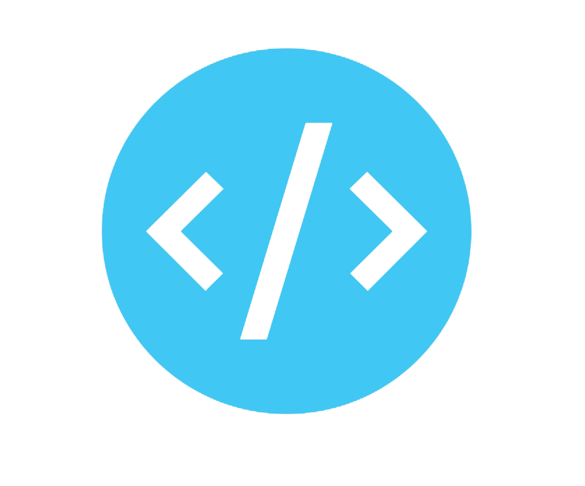

<h3 align="center">
  Hi there, I'm <a href="#" >Arsalan Javed</a>
  </h3>
<h2 align="center">
I'm a Computer Engineer💻 & Full-Stack Web Developer 
</h2> 
  <ul>
  <li> Graduated NUST'22 </li>
  <li>I’m working as a Software Engineer and contributing to frontend and backend for building web applications.</li>
  <li>Starting a Professional life &#128526</li>
</ul>
<h2 align="center">
  <a href="https://linktr.ee/arsalanjaved"  target="_blank" alt="Arsalan Javed">🤝 Let's Connect!</a>
</h2>
  <h3>:fire: My Stats :</h3>
  
 

 

 
  # Tools Used

  

  
   # Languages
  

    <a>
     &nbsp;
  &nbsp;
  &nbsp;
    &nbsp;
     &nbsp;
    &nbsp;
        &nbsp;
  &nbsp;
  </a>
  

  
  # Areas of work

  
  

